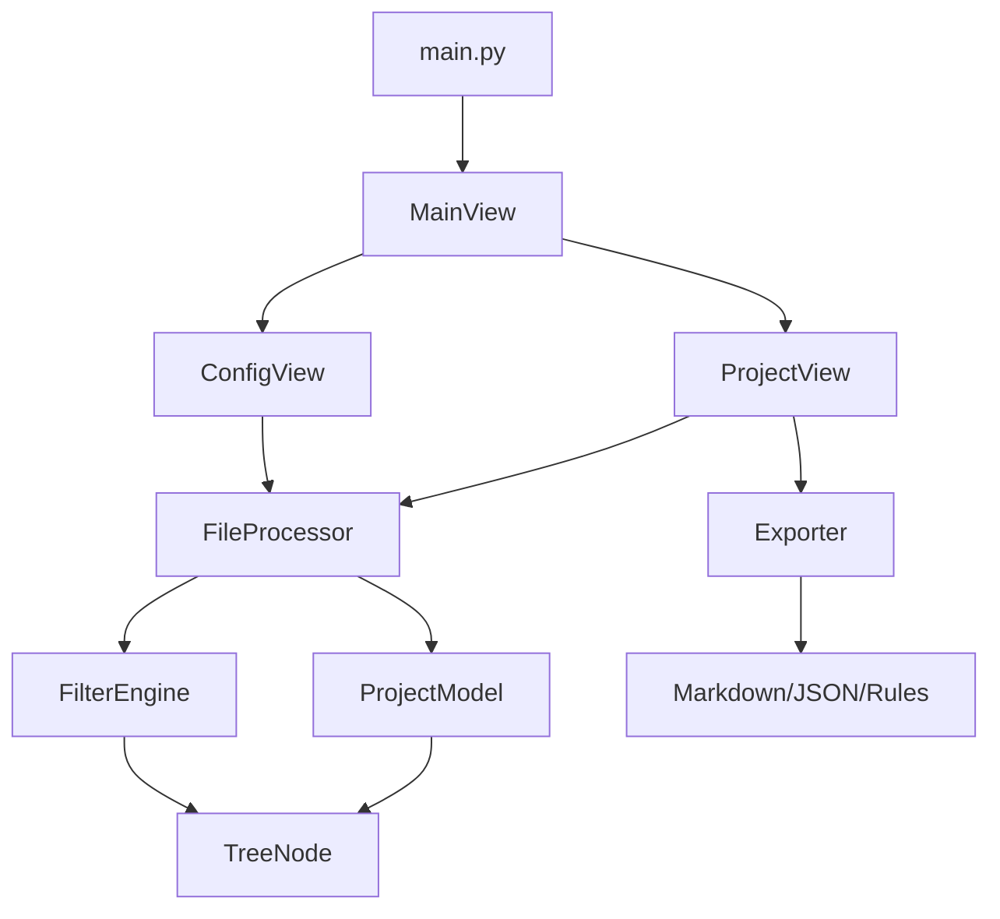

# σ₂: System Patterns
*v1.0 | Created: 2025-01-17 | Updated: 2025-01-17*
*Π: DEVELOPMENT | Ω: PLAN*

## 🏛️ Architecture Overview
工程结构分析工具采用分层架构模式，确保代码的清晰性、可维护性和可扩展性。

```
工程结构梳理工具/
├── 应用层 (UI)               # 用户界面层
│   ├── main_view.py         # 主界面控制器
│   ├── config_view.py       # 配置界面控制器
│   └── project_view.py      # 工程运维界面控制器
├── 业务逻辑层                # 核心业务处理
│   ├── file_processor.py    # 文件处理核心引擎
│   ├── filter_engine.py     # 过滤逻辑引擎
│   └── exporter.py          # 导出处理模块
├── 数据层                   # 数据结构定义
│   ├── project_model.py     # 工程数据模型
│   └── tree_node.py         # 树节点数据结构
├── 工具层                   # 通用工具函数
│   ├── utils.py             # 通用工具函数
│   └── path_utils.py        # 路径处理工具
├── exports/                 # 导出文件存储目录
└── main.py                  # 程序入口点
```

## 🔧 Design Patterns

### MVC 模式
- **Model**: `project_model.py`, `tree_node.py` - 数据模型
- **View**: `main_view.py`, `config_view.py`, `project_view.py` - 视图层
- **Controller**: `file_processor.py`, `filter_engine.py` - 控制逻辑

### 策略模式
- **过滤策略**: `filter_engine.py` 实现多种过滤算法
- **导出策略**: `exporter.py` 支持多种导出格式

### 观察者模式
- UI 组件通过回调函数与业务逻辑层通信
- 进度更新和状态变化的事件处理

## 📊 Component Interactions



## 🗂️ Data Flow

1. **扫描阶段**:
   ```
   用户选择目录 → ConfigView → FileProcessor → 递归扫描 → TreeNode 构建
   ```

2. **过滤阶段**:
   ```
   用户配置过滤条件 → FilterEngine → 应用规则 → 更新 TreeNode
   ```

3. **展示阶段**:
   ```
   TreeNode 数据 → ProjectView → 树状显示 → 用户交互编辑
   ```

4. **导出阶段**:
   ```
   ProjectModel → Exporter → 格式转换 → 文件保存
   ```

## 🎯 Key Design Decisions

### D1: 分层架构选择
- **决策**: 采用四层架构（UI/逻辑/数据/工具）
- **理由**: 职责分离，便于维护和测试
- **影响**: 代码结构清晰，但增加了复杂性

### D2: Tkinter GUI 框架
- **决策**: 使用 Tkinter 而非其他 GUI 框架
- **理由**: Python 内置，无需额外依赖，跨平台兼容性好
- **影响**: 开发简单，但 UI 美观度有限

### D3: 树形数据结构
- **决策**: 使用 TreeNode 类表示文件系统结构
- **理由**: 自然映射文件系统层次结构
- **影响**: 递归处理简单，但深层次可能有性能问题

### D4: 多格式导出支持
- **决策**: 支持 Markdown、JSON、Cursor Rules 三种格式
- **理由**: 满足不同使用场景需求
- **影响**: 增加了导出模块的复杂性

## 🔄 Extension Points

1. **新增导出格式**: 扩展 `exporter.py` 中的导出策略
2. **新增过滤规则**: 扩展 `filter_engine.py` 中的过滤算法
3. **UI 主题**: 扩展 UI 组件的样式系统
4. **插件系统**: 可以添加插件接口支持第三方扩展

## 🛡️ Error Handling Strategy

- **文件访问错误**: 权限检查和异常捕获
- **UI 异常**: 用户友好的错误提示
- **数据验证**: 输入参数验证和边界条件检查
- **资源管理**: 确保文件句柄和内存的正确释放 